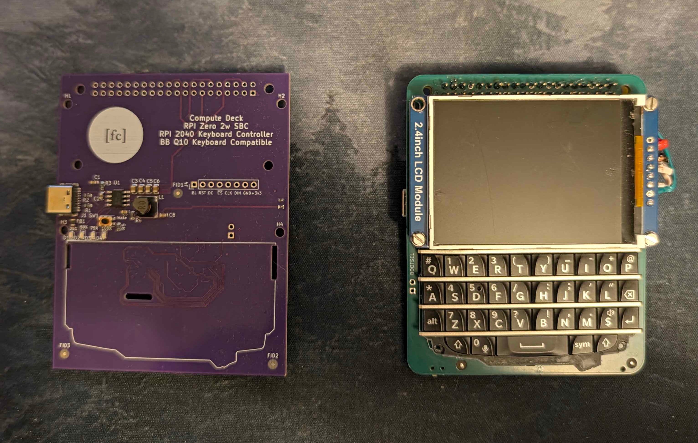

# Compute Deck



**Compute Deck** is an open-source portable Linux computer and cyberdeck platform. It features a BlackBerry Q10 physical keyboard, dedicated power management with LiPo charging, an RP2040 coprocessor serving as an I2C keyboard bridge, and a Linux compute module.

> [!WARNING]
> ### ⚠️ Hardware Revision Notice: RK3566 Migration In Progress
>
> Revisions 1 and 2 of this project were built and verified around a **Raspberry Pi Zero / Zero 2 W** form-factor header.
>
> The project is currently undergoing a major hardware architecture update to migrate from the Pi Zero header to an integrated Rockchip RK3566 SoC directly on the board.
---

## Project Overview & Key Features

- **Physical Keyboard Integration:** Uses a BlackBerry Q10 keyboard connected using a 24-pin Hirose BM14B connector.
- **Dedicated RP2040 Coprocessor:** Offloads the keyboard control from the processor, supporting debouncing, key remapping, and layer management.
- **I2C Slave Keyboard Bridge:** Communicates with the host system via I2C at address `0x1F`, sending keycodes to the main processor.
- **Power Management Subsystem:** Integrated IP5306 power bank SoC managing single-cell LiPo battery charging, 5V boost conversion, power routing, status LEDs, and soft-latching power control alongside an AMS1117-3.3 regulator.
- **Linux Host Virtual Keyboard Driver:** Python user-space daemon using Linux `/dev/uinput` and `evdev` to translate the RP2040 I2C keycodes into full USB keyboard input with support for modifiers.

---

## Repository Structure

```
compute-deck/
├── firmware/                   # RP2040 Coprocessor Firmware (Pico SDK C/C++)
│   ├── CMakeLists.txt          # CMake build configuration
│   ├── main.c                  # Keyboard matrix scanner, layer logic & I2C slave handler
├── hardware/                   # KiCad PCB & Schematic Design Files
│   ├── footprints/             # Custom KiCad component footprints
│   ├── symbols/                # Custom KiCad schematic symbols
├── host/                       # Host Linux Software & Services
│   ├── keyboard_driver.py      # Python I2C polling daemon & uinput event injector
│   ├── q10-keyboard.service    # Systemd service unit for boot startup
```

---

## RP2040 Firmware Setup

### Build Prerequisites

- [Raspberry Pi Pico SDK](https://github.com/raspberrypi/pico-sdk) configured in your environment (`PICO_SDK_PATH`).
- `cmake`
- GCC ARM Cross-compiler (`arm-none-eabi-gcc`)

### Building the Firmware

```bash
cd firmware
mkdir build
cd build
cmake ..
make -j$(nproc)
```

### Flashing

1. Short the `BOOTSEL` jumper on the board using tweezers or other conductive object while plugging in USB to enter the RP2040 into bootloader mode.
2. Drag and drop `q10_keyboard.uf2` onto the mounted `RPI-RP2` USB storage drive.

---

## Host Driver Setup (Linux / Raspberry Pi OS)

The host driver in `host/` runs on the Linux compute host (e.g. Raspberry Pi OS or Linux kernel with `/dev/uinput` enabled).

### 1. Enable I2C Interface
Enable the hardware I2C interface on the host SBC:

```bash
sudo raspi-config nonint do_i2c 0
```

### 2. Install Dependencies
```bash
sudo apt-get install python3-pip python3-smbus
pip3 install -r host/requirements.txt
```

### 3. Grant Permissions

Add your user to the `i2c` and `input` groups:

```bash
sudo usermod -aG i2c,input $USER
```

### 4. Running the Driver

Run the driver manually to verify key injection:

```bash
python3 host/keyboard_driver.py
```

### 5. Install as a Systemd Daemon

To launch the keyboard driver automatically at boot:

```bash
sudo mkdir -p /opt/q10-keyboard
sudo cp host/keyboard_driver.py /opt/q10-keyboard/
sudo cp host/q10-keyboard.service /etc/systemd/system/
sudo systemctl daemon-reload
sudo systemctl enable --now q10-keyboard.service
```

---

## Keyboard Layout & Modifier Behavior

The physical layout follows the BlackBerry Q10 matrix mapping:

- **Shift:** One-shot modifier. Pressing Shift capitalizes the next key typed, and then automatically clears.
- **Alt:** Accesses numbers and secondary symbols printed on keycaps (e.g., Q -> `#`, W -> `1`, E -> `2`).
- **Sym:** Accesses extended navigation and punctuation symbols (e.g., Q -> `Esc`, W -> `Up`, A -> `Left`, S -> `Down`, D -> `Right`, T -> `Tab`).
- **Mic Key:** Mapped as Super. Supports tap-or-chord timeout (`0.4s`).
- **Ctrl:** Left Control key with chord support.

---

## Fabrication & Manufacturing

Production files generated for JLCPCB are stored under `hardware/production/`
